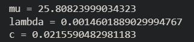
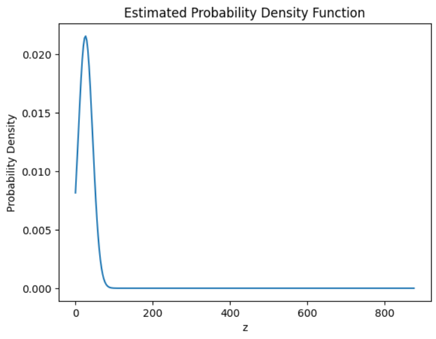

# Probability Density Functions Assignment 1-UCS654

This repository contains the solution for Assignment-1, which focuses on
learning the parameters of a probability density function using a
roll-number-parameterized non-linear transformation.

## Dataset
India Air Quality Dataset  
Feature used: NO₂ concentration

## Transformation
Each NO₂ value (x) is transformed into z using a non-linear function:

z = x + a_r sin(b_r x)

where:
- a_r = 0.05 × (r mod 7)
- b_r = 0.3 × (r mod 5 + 1)
- r is the university roll number

## Probability Density Function
The transformed variable z is modeled using:

p̂(z) = c · exp(−λ (z − μ)²)

## Parameter Estimation
The parameters μ, λ, and c are estimated using the **Method of Moments**.

## Output Values

## Estimated PDF Plot

## Tools Used
- Python
- NumPy
- Pandas
- Matplotlib
